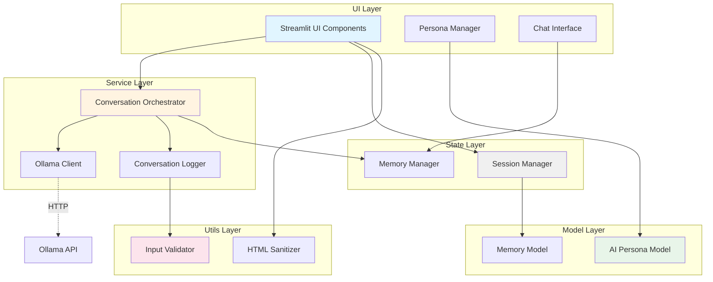
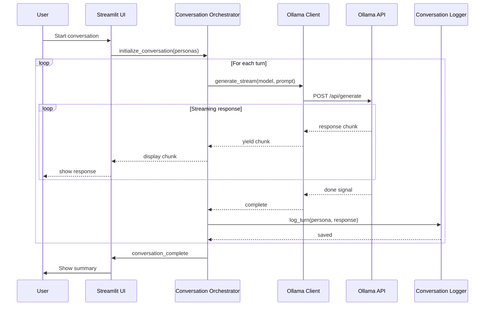
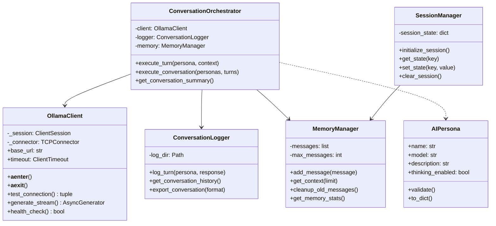
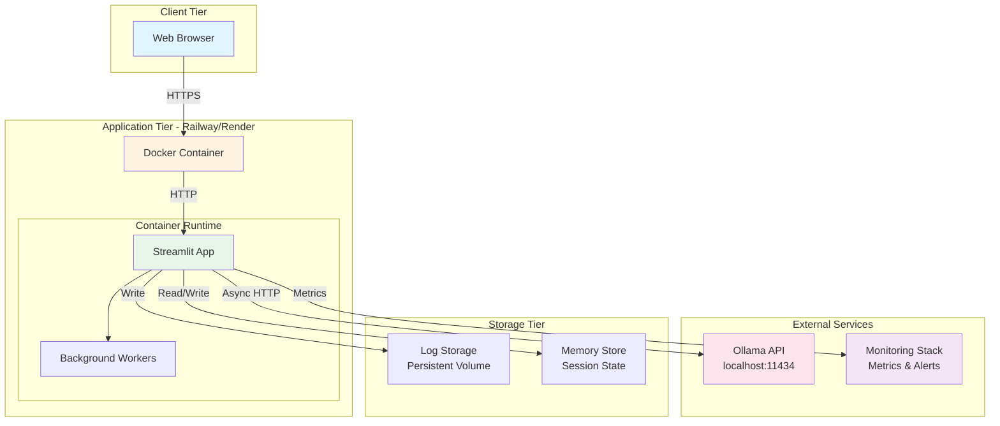

# python-architecture-diagram-generator

**Purpose**: Generate professional architecture diagrams from Python codebase analysis

**Use When**: Need to visualize system architecture, document component relationships, or create technical diagrams for documentation

---

## Domain Knowledge

### Architecture Diagram Types
- **Component Diagrams**: High-level system components and their relationships
- **Sequence Diagrams**: Interaction flows between components over time
- **Class Diagrams**: Object-oriented structure and inheritance
- **Deployment Diagrams**: Infrastructure and deployment topology

### Mermaid Syntax for Diagrams
- Flowcharts for component relationships
- Sequence diagrams for interaction flows
- Class diagrams for OOP structure
- State diagrams for application lifecycle

### Visualization Best Practices
- Clear component boundaries and interfaces
- Logical grouping of related components
- Directional arrows showing data/control flow
- Color coding for different layers/concerns
- Comprehensive legends and annotations

---

## Workflow

### Step 1: Analyze Codebase Structure (45-60 min)

**Actions**:
```bash
# Map directory structure
tree src/ -L 3 --dirsfirst

# Find all Python modules
find src/ -name "*.py" -type f | sort

# Identify major components
grep -r "^class " src/ --include="*.py" | cut -d: -f1 | sort -u

# Find service boundaries
grep -r "from src\." src/ --include="*.py" | cut -d: -f2 | sort -u
```

**Document Component Categories**:
| Category | Files | Purpose | Dependencies |
|----------|-------|---------|--------------|
| Services | ollama_client.py, logger.py | Business logic | aiohttp, asyncio |
| Models | persona.py, memory.py | Data structures | None |
| UI | components.py, accessibility.py | Streamlit interface | streamlit |
| Utils | validation.py, sanitization.py | Support functions | bleach |
| State | session_manager.py | State management | streamlit |

### Step 2: Identify Component Relationships (30-45 min)

**Pattern: Dependency Analysis**:
```python
import ast
import os
from collections import defaultdict

def analyze_imports(file_path: str) -> list[str]:
    """Extract imports from Python file.

    Returns:
        list: Imported module names
    """
    with open(file_path) as f:
        tree = ast.parse(f.read())

    imports = []
    for node in ast.walk(tree):
        if isinstance(node, ast.Import):
            for alias in node.names:
                imports.append(alias.name)
        elif isinstance(node, ast.ImportFrom):
            if node.module:
                imports.append(node.module)

    return imports

def build_dependency_graph(src_dir: str) -> dict:
    """Build dependency graph from source directory.

    Returns:
        dict: Component -> list of dependencies
    """
    graph = defaultdict(list)

    for root, dirs, files in os.walk(src_dir):
        for file in files:
            if file.endswith('.py'):
                path = os.path.join(root, file)
                component = path.replace(src_dir, '').strip('/')
                imports = analyze_imports(path)

                # Filter for internal dependencies
                internal = [i for i in imports if i.startswith('src.')]
                graph[component] = internal

    return dict(graph)
```

**Actions**:
- Run dependency analysis script
- Document component relationships
- Identify circular dependencies
- Map data flow patterns

### Step 3: Design Component Diagram (45-60 min)

**Pattern: High-Level System Architecture**:


**Diagram Specifications**:
- Use subgraphs for architectural layers
- Solid arrows for direct dependencies
- Dashed arrows for external services
- Color coding by layer type
- Clear component labels

### Step 4: Create Sequence Diagram (30-45 min)

**Pattern: Conversation Flow**:


**Actions**:
- Document key interaction flows
- Identify async operations
- Show error handling paths
- Include timeout scenarios

### Step 5: Generate Class Diagram (45-60 min)

**Pattern: Object-Oriented Structure**:


**Actions**:
- Extract all class definitions
- Document public methods and properties
- Show inheritance relationships
- Include composition patterns

### Step 6: Create Deployment Diagram (30-45 min)

**Pattern: Production Infrastructure**:


**Actions**:
- Document deployment topology
- Show network boundaries
- Include persistence layers
- Mark security boundaries

### Step 7: Export Diagrams in Multiple Formats (30-45 min)

**Export Formats**:
1. **Markdown with Mermaid** (for GitHub, documentation)
2. **PNG/SVG** (for presentations, reports)
3. **PDF** (for formal documentation)
4. **Interactive HTML** (for web documentation)

**Implementation Pattern**:
```python
import subprocess
from pathlib import Path

def export_mermaid_diagram(
    mermaid_code: str,
    output_path: Path,
    format: str = "png"
) -> None:
    """Export Mermaid diagram to various formats.

    Args:
        mermaid_code: Mermaid diagram syntax
        output_path: Output file path
        format: Output format (png, svg, pdf)

    Example:
        export_mermaid_diagram(component_diagram, "docs/architecture.png", "png")
    """
    # Write mermaid code to temp file
    temp_file = Path("/tmp/diagram.mmd")
    temp_file.write_text(mermaid_code)

    # Use mermaid-cli to convert
    subprocess.run([
        "mmdc",
        "-i", str(temp_file),
        "-o", str(output_path),
        "-b", "transparent",
        "-t", "default"
    ], check=True)
```

**Actions**:
- Create diagrams directory structure
- Export all diagrams in multiple formats
- Validate visual quality
- Include in documentation

### Step 8: Generate Documentation (45-60 min)

**Pattern: Architecture Documentation**:
```markdown
# Infinite Backrooms - System Architecture

## Overview
The Infinite Backrooms application is a multi-AI conversation orchestration platform built with Streamlit and Python async/await patterns.

## Architecture Layers

### UI Layer (Streamlit Components)
- **Purpose**: User interface and interaction
- **Components**: Chat interface, persona manager, accessibility features
- **Technology**: Streamlit, custom CSS (System 7 theme)

### Service Layer (Business Logic)
- **Purpose**: Core conversation orchestration and AI communication
- **Components**: Conversation orchestrator, Ollama client, logger
- **Technology**: Python async/await, aiohttp, connection pooling

### State Layer (Session Management)
- **Purpose**: Maintain conversation state across reruns
- **Components**: Session manager, memory manager
- **Technology**: Streamlit session state, bounded collections

### Model Layer (Data Structures)
- **Purpose**: Define domain models
- **Components**: AI persona, memory model
- **Technology**: Python dataclasses, Pydantic

### Utils Layer (Support Functions)
- **Purpose**: Cross-cutting concerns
- **Components**: Input validation, HTML sanitization, performance monitoring
- **Technology**: Bleach, custom validators

## Component Diagram
[Include exported PNG]

## Sequence Diagrams

### Conversation Flow
[Include exported PNG]

### Error Handling Flow
[Include exported PNG]

## Class Structure
[Include exported PNG]

## Deployment Architecture
[Include exported PNG]

## Key Design Decisions

1. **Singleton Pattern for Ollama Client**:
   - Rationale: Reuse connection pool across Streamlit reruns
   - Implementation: `@st.experimental_singleton` decorator

2. **Async/Await Throughout**:
   - Rationale: Non-blocking I/O for responsive UI
   - Implementation: `asyncio.run()` with thread fallback

3. **Bounded Memory Management**:
   - Rationale: Prevent memory leaks from unbounded growth
   - Implementation: Max 1000 messages with automatic cleanup

4. **Layered Architecture**:
   - Rationale: Separation of concerns, testability
   - Implementation: Clear boundaries between UI, service, state, model, utils

## Performance Characteristics

- **Connection Pooling**: 100 max connections, 10 per host
- **Memory Limits**: 1000 messages maximum, 30-day retention
- **Timeout Configuration**: 300s default, configurable per request
- **Streaming**: Async generators for real-time response display

## Security Measures

- **XSS Prevention**: Bleach-based HTML sanitization
- **Input Validation**: Comprehensive validation on all inputs
- **Path Traversal Protection**: Validated file operations
- **Log Injection Prevention**: Sanitized log entries

## Scalability Considerations

- **Horizontal Scaling**: Stateless design supports multiple instances
- **Resource Management**: Connection pooling and bounded memory
- **Monitoring**: Comprehensive metrics and health checks
- **Deployment**: Docker containerization with multi-platform support
```

**Actions**:
- Create comprehensive architecture.md
- Include all diagrams
- Document design decisions
- Explain rationale for patterns

---

## Best Practices

### Diagram Creation
1. Start with high-level component view
2. Drill down into detailed interactions
3. Show both structure and behavior
4. Use consistent notation throughout

### Mermaid Syntax
1. Use subgraphs for logical grouping
2. Apply color coding consistently
3. Label all arrows with actions/data
4. Include legends for complex diagrams

### Documentation
1. Explain "why" not just "what"
2. Link diagrams to code sections
3. Keep diagrams updated with code
4. Version control all diagram sources

### Export Quality
1. Use high DPI for raster images
2. Prefer vector formats (SVG) when possible
3. Test rendering in target formats
4. Validate accessibility

---

## Success Criteria

- [ ] Component diagram clearly shows all major components
- [ ] Sequence diagrams document key interaction flows
- [ ] Class diagram accurately reflects OOP structure
- [ ] Deployment diagram shows production topology
- [ ] All diagrams exported in at least 2 formats
- [ ] Architecture documentation comprehensive and clear
- [ ] Diagrams included in project documentation
- [ ] Code references validate against actual structure

---

## Common Issues & Solutions

### Issue: Mermaid syntax errors
**Solution**: Validate syntax at mermaid.live before exporting

### Issue: Diagrams too complex to read
**Solution**: Break into multiple focused diagrams, use subgraphs

### Issue: Outdated diagrams
**Solution**: Generate from code analysis, version control diagram sources

### Issue: Export quality poor
**Solution**: Use SVG format, increase DPI settings, use proper rendering tools

---

## Tools Available
- Read: Analyze codebase structure
- Write: Create diagram files
- Bash: Run analysis scripts, export diagrams
- Grep: Find class definitions, imports
- Glob: List all Python files
- canvas-design: Professional diagram styling

---

## Validation Commands

```bash
# Analyze codebase structure
tree src/ -L 3 --dirsfirst

# Find all classes
grep -r "^class " src/ --include="*.py"

# Analyze imports
grep -r "^from \|^import " src/ --include="*.py" | sort -u

# Validate Mermaid syntax (requires mermaid-cli)
mmdc --version

# Export diagram
mmdc -i diagram.mmd -o architecture.png -b transparent

# Create diagrams directory
mkdir -p docs/diagrams

# List generated diagrams
ls -lh docs/diagrams/
```

---

## Example: Complete Workflow

```bash
# 1. Analyze structure
python scripts/analyze_architecture.py > architecture_analysis.txt

# 2. Generate Mermaid diagrams
cat > component_diagram.mmd <<'EOF'
graph TB
    [... mermaid syntax ...]
EOF

# 3. Export to multiple formats
mmdc -i component_diagram.mmd -o docs/diagrams/components.png
mmdc -i component_diagram.mmd -o docs/diagrams/components.svg
mmdc -i component_diagram.mmd -o docs/diagrams/components.pdf

# 4. Include in documentation
echo "## Architecture" >> docs/ARCHITECTURE.md
echo "" >> docs/ARCHITECTURE.md

# 5. Validate
open docs/ARCHITECTURE.md
```
