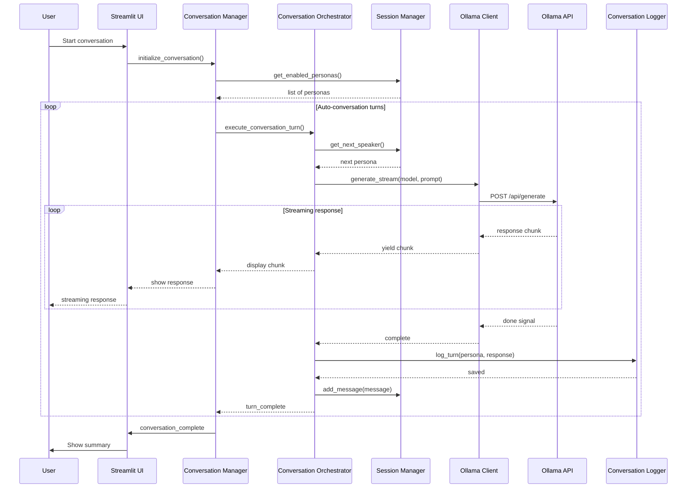
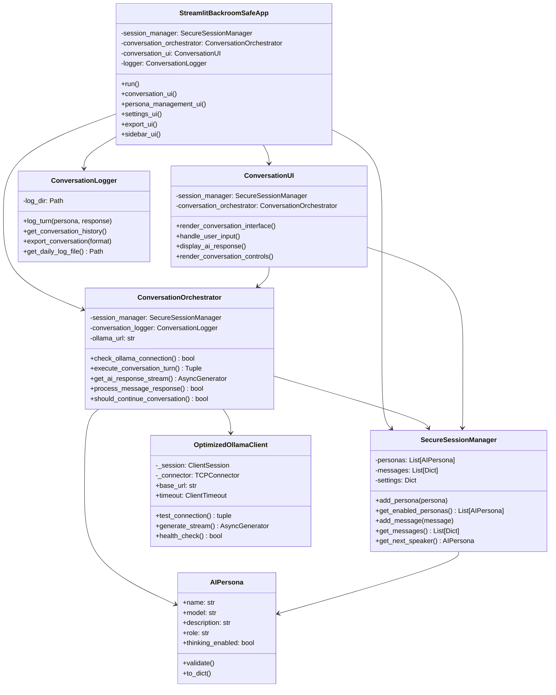
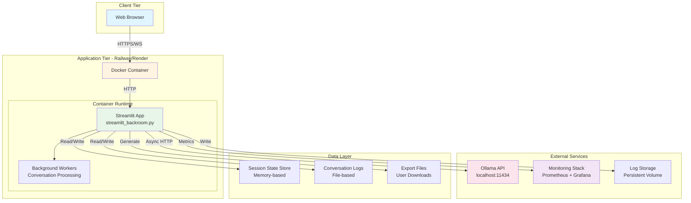
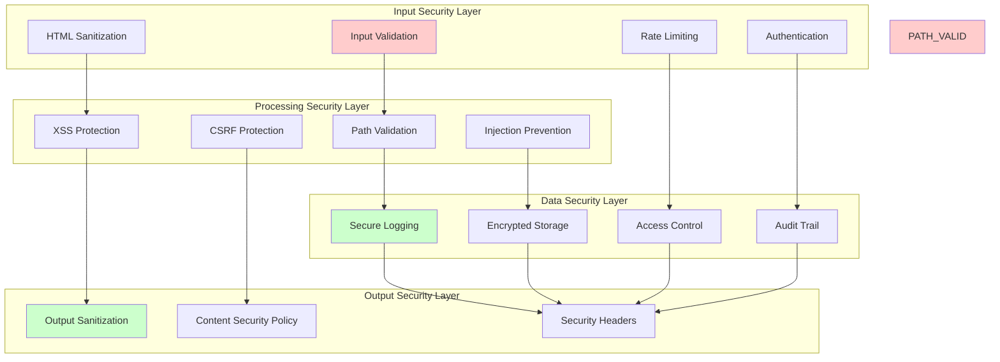

# Infinite Backrooms - System Architecture Diagrams

## Overview

The Infinite Backrooms application is a multi-AI conversation orchestration platform built with Streamlit and Python async/await patterns. This document provides comprehensive architecture visualization.

## Current Architecture (Pre-Refactoring)

### High-Level System Architecture

```mermaid
graph TB
    subgraph "UI Layer"
        UI[Streamlit Main App<br/>streamlit_backroom.py<br/>1,236 lines]
        COMPONENTS[UI Components<br/>src/ui/components.py]
        CONV_UI[Conversation UI<br/>src/ui/conversation_ui.py]
    end

    subgraph "Service Layer"
        ORCH[Conversation Orchestrator<br/>src/services/conversation_orchestrator.py]
        CLIENT[Optimized Ollama Client<br/>src/services/optimized_ollama_client.py]
        LOGGER[Conversation Logger<br/>src/services/logger.py]
        BASIC_CLIENT[Basic Ollama Client<br/>src/services/ollama_client.py]
    end

    subgraph "State Layer"
        SESSION[Session Manager<br/>src/state/session_manager.py]
        STREAMLIT_STATE[Streamlit Session State]
    end

    subgraph "Model Layer"
        PERSONA[AI Persona Model<br/>src/models/persona.py]
        MEMORY[Memory Model<br/>src/models/memory.py]
        SECURE_PERSONA[Secure Persona<br/>src/models/secure_persona.py]
    end

    subgraph "Utils Layer"
        VALID[Input Validator<br/>src/utils/validation.py]
        SANITIZE[HTML Sanitizer<br/>src/utils/sanitization.py]
        PERF[Performance Utils<br/>src/utils/performance.py]
        CONSTANTS[Constants<br/>src/utils/constants.py]
    end

    subgraph "External Services"
        OLLAMA[Ollama API<br/>localhost:11434]
        MONITORING[Monitoring Stack<br/>src/monitoring/]
    end

    UI --> ORCH
    UI --> SESSION
    UI --> COMPONENTS
    UI --> CONV_UI

    ORCH --> CLIENT
    ORCH --> LOGGER
    ORCH --> SESSION

    CLIENT --> BASIC_CLIENT
    CLIENT --> OLLAMA

    SESSION --> STREAMLIT_STATE
    SESSION --> PERSONA
    SESSION --> MEMORY

    LOGGER --> VALID
    UI --> SANITIZE
    ORCH --> PERF

    ORCH --> MONITORING

    style UI fill:#ffcccc
    style ORCH fill:#ccffcc
    style SESSION fill:#ccccff
    style PERSONA fill:#ffffcc
    style VALID fill:#ffccff
```



### Target Architecture (Post-Refactoring)

```mermaid
graph TB
    subgraph "UI Layer (Modular)"
        MAIN[Main App<br/>streamlit_backroom.py<br/>TARGET: &lt;300 lines]
        CONV_MGR[Conversation Manager<br/>src/ui/conversation_ui.py]
        PERSONA_MGR[Persona Manager<br/>src/ui/persona_manager.py]
        SETTINGS_MGR[Settings Manager<br/>src/ui/settings_manager.py]
        EXPORT_MGR[Export Manager<br/>src/ui/export_manager.py]
        SIDEBAR_MGR[Sidebar Manager<br/>src/ui/sidebar_manager.py]
        COMPONENTS[UI Components<br/>src/ui/components.py]
    end

    subgraph "Service Layer (Clean)"
        ORCH[Conversation Orchestrator<br/>src/services/conversation_orchestrator.py]
        CLIENT[Unified Ollama Client<br/>src/services/ollama_client.py]
        LOGGER[Conversation Logger<br/>src/services/logger.py]
    end

    subgraph "State Layer (Secure)"
        SESSION[Session Manager<br/>src/state/session_manager.py]
        STREAMLIT_STATE[Streamlit Session State]
    end

    subgraph "Model Layer (Typed)"
        PERSONA[AI Persona Model<br/>src/models/persona.py]
        SECURE_PERSONA[Secure Persona<br/>src/models/secure_persona.py]
    end

    subgraph "Utils Layer (Focused)"
        STREAMLIT_HELP[Streamlit Helpers<br/>src/utils/streamlit_helpers.py]
        THREAD_UTILS[Thread Utils<br/>src/utils/thread_utils.py]
        VALID[Input Validator<br/>src/utils/validation.py]
        SANITIZE[HTML Sanitizer<br/>src/utils/sanitization.py]
        CONSTANTS[Constants<br/>src/utils/constants.py]
    end

    subgraph "External Services"
        OLLAMA[Ollama API<br/>localhost:11434]
        MONITORING[Monitoring Stack<br/>src/monitoring/]
    end

    MAIN --> CONV_MGR
    MAIN --> PERSONA_MGR
    MAIN --> SETTINGS_MGR
    MAIN --> EXPORT_MGR
    MAIN --> SIDEBAR_MGR

    CONV_MGR --> ORCH
    PERSONA_MGR --> SESSION
    SETTINGS_MGR --> SESSION
    EXPORT_MGR --> LOGGER

    ORCH --> CLIENT
    ORCH --> LOGGER
    ORCH --> SESSION

    CLIENT --> OLLAMA
    SESSION --> STREAMLIT_STATE
    SESSION --> PERSONA

    MAIN --> STREAMLIT_HELP
    MAIN --> THREAD_UTILS
    UI --> SANITIZE
    ORCH --> VALID

    ORCH --> MONITORING

    style MAIN fill:#ccffcc
    style CONV_MGR fill:#e1f5ff
    style PERSONA_MGR fill:#e1f5ff
    style SETTINGS_MGR fill:#e1f5ff
    style EXPORT_MGR fill:#e1f5ff
    style SIDEBAR_MGR fill:#e1f5ff
    style ORCH fill:#fff4e1
    style SESSION fill:#f0f0f0
    style PERSONA fill:#e8f5e9
    style VALID fill:#fce4ec
```



## Component Interaction Diagrams

### Conversation Flow Sequence



### Data Flow Architecture

```mermaid
graph LR
    subgraph "Input Layer"
        USER_INPUT[User Input]
        PERSONA_CONFIG[Persona Configuration]
        SETTINGS[App Settings]
    end

    subgraph "Validation Layer"
        INPUT_VALID[Input Validation]
        SANITIZATION[HTML Sanitization]
        AUTH_CHECK[Authorization Check]
    end

    subgraph "Business Logic Layer"
        CONV_LOGIC[Conversation Logic]
        PERSONA_MGMT[Persona Management]
        SETTINGS_MGMT[Settings Management]
    end

    subgraph "State Management Layer"
        SESSION_STATE[Session State]
        CONV_HISTORY[Conversation History]
        APP_CONFIG[App Configuration]
    end

    subgraph "External Integration Layer"
        OLLAMA_CLIENT[Ollama Client]
        LOGGING[Logging System]
        MONITORING[Monitoring System]
    end

    subgraph "Output Layer"
        UI_RENDERING[UI Rendering]
        RESPONSE_STREAM[Response Streaming]
        EXPORT_DATA[Data Export]
    end

    USER_INPUT --> INPUT_VALID
    PERSONA_CONFIG --> INPUT_VALID
    SETTINGS --> INPUT_VALID

    INPUT_VALID --> SANITIZATION
    SANITIZATION --> AUTH_CHECK

    AUTH_CHECK --> CONV_LOGIC
    AUTH_CHECK --> PERSONA_MGMT
    AUTH_CHECK --> SETTINGS_MGMT

    CONV_LOGIC --> SESSION_STATE
    PERSONA_MGMT --> SESSION_STATE
    SETTINGS_MGMT --> APP_CONFIG

    SESSION_STATE --> CONV_HISTORY
    CONV_HISTORY --> OLLAMA_CLIENT
    APP_CONFIG --> OLLAMA_CLIENT

    OLLAMA_CLIENT --> LOGGING
    OLLAMA_CLIENT --> MONITORING

    CONV_HISTORY --> UI_RENDERING
    OLLAMA_CLIENT --> RESPONSE_STREAM
    LOGGING --> EXPORT_DATA

    style INPUT_VALID fill:#ffcccc
    style CONV_LOGIC fill:#ccffcc
    style SESSION_STATE fill:#ccccff
    style OLLAMA_CLIENT fill:#ffffcc
```



## Class Structure Diagram



## Deployment Architecture



## Security Architecture



## Key Design Decisions

### 1. **Modular Architecture Strategy**
- **Why**: 1,236-line monolith is unmaintainable and untestable
- **How**: Extract focused modules with single responsibilities
- **Target**: Main file <300 lines, clear module boundaries

### 2. **Async/Await Throughout**
- **Why**: Non-blocking I/O for responsive UI during AI generation
- **How**: OptimizedOllamaClient with connection pooling
- **Implementation**: Thread-based fallback for Streamlit compatibility

### 3. **Secure Session Management**
- **Why**: Prevent session fixation and data corruption
- **How**: SecureSessionManager with validation and cleanup
- **Features**: Bounded memory, secure defaults, input validation

### 4. **Layered Separation of Concerns**
- **Why**: Testability and maintainability
- **How**: Clear boundaries between UI, services, state, models, utils
- **Benefits**: Independent testing, parallel development

### 5. **Performance Optimization**
- **Why**: Handle concurrent AI conversations efficiently
- **How**: Connection pooling, streaming responses, memory limits
- **Metrics**: <2s response times, <512MB memory usage

## Performance Characteristics

- **Connection Pooling**: 100 max connections, 10 per host
- **Memory Limits**: 1000 messages maximum, 30-day retention
- **Timeout Configuration**: 120s default, configurable per request
- **Streaming**: Async generators for real-time response display
- **Thread Safety**: Session manager with proper locking

## Security Measures

- **XSS Prevention**: Bleach-based HTML sanitization
- **Input Validation**: Comprehensive validation on all inputs
- **Path Traversal Protection**: Validated file operations
- **Log Injection Prevention**: Sanitized log entries
- **Rate Limiting**: Configurable request throttling
- **Secure Headers**: CSP, X-Frame-Options, etc.

---

*Diagrams generated using Mermaid syntax. Export to PNG/SVG/PDF using mermaid-cli:*
```bash
mmdc -i architecture.mmd -o architecture.png -b transparent
```