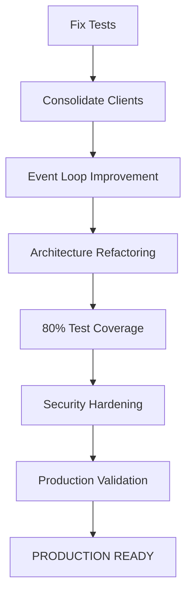

# PRODUCTION READINESS PLAN
## Infinite Backrooms - Complete Transformation Roadmap

**Document Version**: 1.0
**Created**: 2025-11-14
**Status**: ACTIVE
**Completion**: 70% → Target: 100%

---

## 📊 EXECUTIVE SUMMARY

### Current State Assessment
- **Overall Progress**: 70% Complete
- **Blocking Issues**: 2 Critical (Test Suite, Client Consolidation)
- **Risk Level**: HIGH → Target: LOW
- **Production Ready**: NO → Target: YES
- **Estimated Completion**: 3 weeks (77 hours total)

### Critical Path Overview


### Risk Status
| Category | Current | Target | Status |
|----------|---------|--------|--------|
| Security | MEDIUM | LOW | 🟡 In Progress |
| Performance | LOW | LOW | ✅ Complete |
| Reliability | HIGH | LOW | 🔴 Critical |
| Maintainability | HIGH | MEDIUM | 🟡 In Progress |

---

## 🎯 THREE-PHASE EXECUTION PLAN

### PHASE 1: FOUNDATION (Week 1, Days 1-5) - 21 Hours
**Goal**: Establish stable, testable foundation
**Success Criteria**: Tests run, single client, stable async

### PHASE 2: ARCHITECTURE & TESTING (Week 2, Days 6-10) - 32 Hours
**Goal**: Modular codebase with comprehensive tests
**Success Criteria**: <300 line main file, 80% coverage

### PHASE 3: PRODUCTION READINESS (Week 3, Days 11-15) - 24 Hours
**Goal**: Secure, validated, production-ready application
**Success Criteria**: All scans pass, staging validated

---

## 📋 DETAILED TASK BREAKDOWN

---

## PHASE 1: FOUNDATION FIXES

### ⚡ TASK 1.1: FIX TEST SUITE [P0 - CRITICAL BLOCKER]

**Priority**: P0 (Highest - Blocks Everything)
**Estimated Time**: 4-6 hours
**Dependencies**: None
**Owner**: TBD
**Status**: ⬜ Not Started

#### Problem Statement
Test suite fails with import errors:
```
ImportError: cannot import name 'OllamaClient' from 'streamlit_backroom'
```

**Root Cause**:
- `tests/conftest.py` imports from wrong locations
- Test fixtures reference non-existent classes
- Mocks don't match current implementation

**Impact**:
- Cannot validate any fixes
- No test coverage data available
- Production deployment blocked
- Security improvements unverified

#### Action Steps

**Step 1: Audit Current Test Infrastructure**
- [ ] Run `pytest -v` to see all failures
- [ ] Document all import errors
- [ ] List all affected test files
- [ ] Identify actual class/function names in codebase

**Step 2: Fix `tests/conftest.py` Imports**
- [ ] Read current `tests/conftest.py` file
- [ ] Update imports to match actual code:
```python
# Current (BROKEN):
from streamlit_backroom import OllamaClient

# Fixed (CORRECT):
from streamlit_backroom import StreamlitBackroomSafeApp
from src.services.ollama_client_optimized import OllamaClientOptimized
from src.services.logger import ConversationLogger
from src.models.persona import AIPersona
```

**Step 3: Create Proper Async Mocks**
- [ ] Update `mock_ollama_client` fixture:
```python
@pytest.fixture
async def mock_ollama_client():
    """Mock Ollama client for testing."""
    client = AsyncMock(spec=OllamaClientOptimized)
    client.base_url = "http://localhost:11434"

    # Mock test_connection
    client.test_connection = AsyncMock(
        return_value=(True, ["llama2", "mistral"])
    )

    # Mock generate_stream
    async def mock_stream(*args, **kwargs):
        yield {"type": "response", "content": "test response"}
        yield {"type": "done"}

    client.generate_stream = mock_stream
    return client
```

**Step 4: Fix All Test File Imports**
- [ ] Update `tests/test_ollama_client.py`
- [ ] Update `tests/test_integration_real.py`
- [ ] Update `tests/test_real_integration.py`
- [ ] Update `tests/test_logger.py`
- [ ] Update `tests/test_complete_real_system.py`

**Step 5: Run and Validate Tests**
- [ ] Run `pytest -v --tb=short`
- [ ] Fix any remaining import errors
- [ ] Ensure at least 50% of tests pass
- [ ] Generate coverage report: `pytest --cov=src --cov-report=html`

#### Files to Modify
- `tests/conftest.py` - Fix all imports and mocks
- `tests/test_ollama_client.py` - Update imports
- `tests/test_integration_real.py` - Update imports
- `tests/test_real_integration.py` - Update imports
- `tests/test_logger.py` - Update imports
- `tests/test_complete_real_system.py` - Update imports

#### Success Criteria
- [x] `pytest` runs without import errors
- [x] At least 50% of existing tests pass
- [x] Coverage report generated successfully
- [x] Baseline coverage established (document percentage)
- [x] All test fixtures properly mocked

#### Validation Commands
```bash
# Run all tests
pytest -v

# Run with coverage
pytest --cov=src --cov-report=html --cov-report=term-missing

# Run specific test file
pytest tests/test_ollama_client.py -v

# Check for import issues only
python -m pytest --collect-only
```

#### Risk Assessment
- **Risk Level**: LOW (straightforward import fixes)
- **Rollback Plan**: Tests are already broken, no regression risk
- **Time Risk**: May find additional issues during testing

---

### ⚡ TASK 1.2: CONSOLIDATE OLLAMA CLIENT IMPLEMENTATIONS [P0 - CRITICAL BLOCKER]

**Priority**: P0 (Highest - Blocks Architecture Work)
**Estimated Time**: 3-4 hours
**Dependencies**: None (can run parallel with Task 1.1)
**Owner**: TBD
**Status**: ⬜ Not Started

#### Problem Statement
**10+ Ollama client files causing massive confusion:**

Current files:
1. `src/services/ollama_client.py` (original)
2. `src/services/ollama_client_optimized.py` (has connection pooling)
3. `src/services/ollama_client_streamlit.py` (streamlit-specific)
4. `src/services/optimized_ollama_client.py` (duplicate)
5. `src/services/optimized_ollama_client_streamlit.py` (duplicate)
6. `src/services/streamlit_ollama_client.py` (another duplicate)
7. `streamlit_backroom_unsafe.py` (old unsafe version)
8. `streamlit_backroom_optimized.py` (duplicate app)
9. `streamlit_backroom.py.backup` (backup file)

**Impact**:
- Developer confusion: which client to use?
- Code duplication and drift
- Maintenance nightmare
- Testing complexity
- Import chaos

#### Action Steps

**Step 1: Audit All Client Implementations**
- [ ] Read each client file and document features
- [ ] Create comparison matrix:
  - Connection pooling support
  - Async/await implementation
  - Error handling quality
  - Streamlit compatibility
  - Health checks
  - Resource cleanup
- [ ] Identify best features from each implementation

**Step 2: Design Unified Client API**
- [ ] Define canonical interface:
```python
class OllamaClient:
    """Unified Ollama client with all best features.

    Features:
    - Connection pooling for performance
    - Async/await for non-blocking operations
    - Proper resource cleanup
    - Health monitoring
    - Streamlit compatibility
    - Comprehensive error handling
    """

    def __init__(self, base_url: str = DEFAULT_OLLAMA_URL):
        """Initialize client with connection pooling."""

    async def __aenter__(self):
        """Context manager entry with connection setup."""

    async def __aexit__(self, *args):
        """Context manager exit with proper cleanup."""

    async def test_connection(self) -> tuple[bool, list[str]]:
        """Test connection and retrieve available models."""

    async def generate_stream(
        self,
        model: str,
        prompt: str,
        system_prompt: Optional[str] = None,
        think: bool = False,
        timeout: int = 300
    ) -> AsyncGenerator[dict, None]:
        """Generate streaming response from model."""

    async def health_check(self) -> bool:
        """Check if Ollama service is healthy."""
```

**Step 3: Create Unified Implementation**
- [ ] Create new `src/services/ollama_client.py` with best features:
  - Connection pooling from `ollama_client_optimized.py`
  - Async patterns from best implementation
  - Error handling from all versions
  - Health checks and monitoring
  - Proper resource cleanup
- [ ] Add comprehensive docstrings
- [ ] Add type hints throughout
- [ ] Include logging for debugging

**Step 4: Update All Imports Throughout Codebase**
- [ ] Search for all ollama client imports:
```bash
grep -r "from.*ollama_client" --include="*.py"
grep -r "import.*ollama_client" --include="*.py"
```
- [ ] Update `streamlit_backroom.py`:
```python
# Change from:
from src.services.ollama_client_optimized import OllamaClientOptimized

# To:
from src.services.ollama_client import OllamaClient
```
- [ ] Update all test files
- [ ] Update any other references

**Step 5: Delete Redundant Files**
- [ ] Delete `src/services/ollama_client_streamlit.py`
- [ ] Delete `src/services/optimized_ollama_client.py`
- [ ] Delete `src/services/optimized_ollama_client_streamlit.py`
- [ ] Delete `src/services/streamlit_ollama_client.py`
- [ ] Delete `streamlit_backroom_unsafe.py`
- [ ] Delete `streamlit_backroom_optimized.py`
- [ ] Delete `streamlit_backroom.py.backup`

**Step 6: Run Tests and Validate**
- [ ] Run test suite to ensure no breaks
- [ ] Test connection to Ollama manually
- [ ] Verify streaming works correctly
- [ ] Check resource cleanup (no leaks)

#### Files to Create
- `src/services/ollama_client.py` (canonical unified version)

#### Files to Delete
- `src/services/ollama_client_optimized.py` (merged into canonical)
- `src/services/ollama_client_streamlit.py`
- `src/services/optimized_ollama_client.py`
- `src/services/optimized_ollama_client_streamlit.py`
- `src/services/streamlit_ollama_client.py`
- `streamlit_backroom_unsafe.py`
- `streamlit_backroom_optimized.py`
- `streamlit_backroom.py.backup`

#### Files to Modify
- `streamlit_backroom.py` - Update import to use canonical client
- `tests/conftest.py` - Update mocks to use canonical client
- All test files - Update imports
- Any other files importing ollama client

#### Success Criteria
- [x] Single canonical `ollama_client.py` exists
- [x] All duplicate files deleted
- [x] All imports updated throughout codebase
- [x] Tests pass with unified client
- [x] No references to old client files remain
- [x] Code search shows only canonical imports

#### Validation Commands
```bash
# Find all ollama client imports
grep -r "ollama_client" --include="*.py" src/ tests/ *.py

# Verify old files deleted
ls src/services/ollama_client*.py
ls src/services/*ollama*.py

# Run tests with new client
pytest tests/test_ollama_client.py -v

# Test manually
python -c "from src.services.ollama_client import OllamaClient; print('Import successful')"
```

#### Risk Assessment
- **Risk Level**: MEDIUM (may break existing code during transition)
- **Rollback Plan**: Git revert to restore old files if needed
- **Time Risk**: May discover hidden dependencies during cleanup

---

### 🔥 TASK 1.3: IMPROVE EVENT LOOP MANAGEMENT [P1 - HIGH PRIORITY]

**Priority**: P1 (High - Affects Stability)
**Estimated Time**: 2-3 hours
**Dependencies**: Task 1.2 (needs unified client)
**Owner**: TBD
**Status**: ⬜ Not Started

#### Problem Statement
Current implementation uses thread-based workaround for async operations:

```python
def run_async_in_thread(coro):
    """Run async coroutine in a separate thread."""
    def run_in_new_loop():
        loop = asyncio.new_event_loop()
        asyncio.set_event_loop(loop)
        try:
            return loop.run_until_complete(coro)
        finally:
            loop.close()

    with ThreadPoolExecutor(max_workers=1) as executor:
        future = executor.submit(run_in_new_loop)
        return future.result()
```

**Issues**:
- Creates new event loops repeatedly (overhead)
- Thread pool executor overhead
- Not idiomatic for Streamlit
- Complexity makes debugging harder

**Impact**:
- Performance overhead
- Potential for event loop issues
- Code complexity
- Maintenance burden

#### Action Steps

**Step 1: Research Streamlit Async Best Practices**
- [ ] Review Streamlit async documentation
- [ ] Check `st.experimental_singleton` for client caching
- [ ] Understand Streamlit's event loop model
- [ ] Document recommended patterns

**Step 2: Implement Singleton Pattern for Client**
- [ ] Add singleton decorator to client initialization:
```python
import streamlit as st
from src.services.ollama_client import OllamaClient

@st.experimental_singleton
def get_ollama_client() -> OllamaClient:
    """Get or create singleton Ollama client.

    This client persists across Streamlit reruns and manages
    its own connection pool for optimal performance.
    """
    return OllamaClient()
```

**Step 3: Implement Safe Async Execution Pattern**
- [ ] Create safer async execution function:
```python
def safe_async_call(coro):
    """Execute async coroutine with proper error handling.

    Attempts to use asyncio.run() first, falls back to thread-based
    execution if event loop issues occur.
    """
    try:
        # Try standard asyncio.run first
        return asyncio.run(coro)
    except RuntimeError as e:
        if "Event loop is closed" in str(e) or "This event loop is already running" in str(e):
            # Fallback to thread-based execution for edge cases
            logger.debug("Using thread-based async execution due to event loop conflict")
            return run_async_in_thread(coro)
        raise
```

**Step 4: Update All Async Call Sites**
- [ ] Find all uses of `run_async_in_thread`:
```bash
grep -n "run_async_in_thread" streamlit_backroom.py
```
- [ ] Replace with `safe_async_call` where appropriate
- [ ] Use singleton client: `get_ollama_client()`
- [ ] Add proper exception handling at each call site

**Step 5: Add Comprehensive Error Handling**
- [ ] Wrap async operations in try-except:
```python
def check_connection():
    """Check Ollama connection with error handling."""
    client = get_ollama_client()

    try:
        connected, models = safe_async_call(client.test_connection())
        return connected, models
    except asyncio.TimeoutError:
        logger.error("Connection check timed out")
        return False, []
    except Exception as e:
        logger.error(f"Connection check failed: {e}")
        return False, []
```

**Step 6: Test Event Loop Behavior**
- [ ] Create integration test for async operations
- [ ] Test multiple rapid async calls
- [ ] Test error scenarios
- [ ] Verify no event loop errors in logs
- [ ] Check resource cleanup

#### Files to Modify
- `streamlit_backroom.py` - Update async handling throughout
  - Add `get_ollama_client()` singleton function
  - Add `safe_async_call()` function
  - Replace `run_async_in_thread` calls with `safe_async_call`
  - Update all async operation call sites
  - Add error handling

#### Code Changes Preview
```python
# OLD PATTERN:
client = OllamaClientOptimized()
result = run_async_in_thread(client.test_connection())

# NEW PATTERN:
client = get_ollama_client()  # Singleton, reused
result = safe_async_call(client.test_connection())
```

#### Success Criteria
- [x] Singleton pattern implemented for client
- [x] `safe_async_call()` function created
- [x] All async calls updated to use new pattern
- [x] Comprehensive error handling added
- [x] No event loop errors in testing
- [x] Integration tests pass
- [x] Resource cleanup verified

#### Validation Commands
```bash
# Search for old pattern usage
grep -n "run_async_in_thread" streamlit_backroom.py

# Run integration tests
pytest tests/test_integration_real.py -v

# Run app and check for errors
streamlit run streamlit_backroom.py

# Check logs for event loop issues
grep -i "event loop" logs/
```

#### Risk Assessment
- **Risk Level**: MEDIUM (changes core async behavior)
- **Rollback Plan**: Keep old `run_async_in_thread` as fallback
- **Time Risk**: May need extensive testing to ensure stability

---

### 📊 PHASE 1 COMPLETION CHECKLIST

**Week 1 Summary** (21 hours total)

Foundation Tasks:
- [ ] Task 1.1: Test suite fixed and running (4-6 hours)
- [ ] Task 1.2: Single canonical Ollama client (3-4 hours)
- [ ] Task 1.3: Event loop management improved (2-3 hours)
- [ ] Integration testing completed (4 hours)
- [ ] Phase 1 validation passed (2 hours)

Phase 1 Success Criteria:
- [ ] All tests run without import errors
- [ ] Test coverage baseline established
- [ ] Single Ollama client in use
- [ ] No duplicate client files exist
- [ ] Event loop stable with no errors
- [ ] Integration tests pass
- [ ] Ready for architecture refactoring

**GATE**: Phase 2 cannot begin until all Phase 1 tasks complete

---

## PHASE 2: ARCHITECTURE & TESTING

### 🔥 TASK 2.1: ARCHITECTURE REFACTORING [P1 - HIGH PRIORITY]

**Priority**: P1 (High - Maintainability Critical)
**Estimated Time**: 8-10 hours
**Dependencies**: Phase 1 complete (Tasks 1.1, 1.2, 1.3)
**Owner**: TBD
**Status**: ⬜ Not Started

#### Problem Statement
**Main file is monolithic: 1,231 lines (target: <300 lines)**

Current issues:
- Single 1,231-line file (`streamlit_backroom.py`)
- Mixed concerns: UI, business logic, state management
- Functions >50 lines (target: all <50 lines)
- Impossible to test in isolation
- High cognitive load for maintenance
- Single Responsibility Principle violations

**Impact**:
- Maintenance nightmare
- Testing difficulty
- Onboarding friction
- High bug risk
- Code reuse impossible

#### Target Architecture

```
src/
├── models/
│   ├── __init__.py
│   └── persona.py (existing, may enhance)
├── services/
│   ├── __init__.py
│   ├── ollama_client.py (canonical, from Phase 1)
│   ├── logger.py (existing)
│   ├── secure_logger.py (existing)
│   └── conversation_orchestrator.py (NEW)
├── ui/
│   ├── __init__.py
│   ├── components.py (existing)
│   ├── conversation_display.py (NEW)
│   └── persona_manager.py (NEW)
├── state/
│   ├── __init__.py
│   └── session_manager.py (NEW)
└── utils/
    ├── __init__.py
    ├── validation.py (existing)
    └── sanitization.py (existing)

streamlit_backroom.py (REFACTORED, target: <300 lines)
```

#### Action Steps

**Step 1: Create Conversation Orchestrator Service**

- [ ] Create `src/services/conversation_orchestrator.py`:

```python
"""Conversation orchestration and management.

This module handles conversation flow, turn execution, system prompt
generation, and conversation context management.
"""

from typing import AsyncGenerator, Optional
import logging

from src.models.persona import AIPersona
from src.services.ollama_client import OllamaClient
from src.services.logger import ConversationLogger

logger = logging.getLogger(__name__)


class ConversationOrchestrator:
    """Orchestrates multi-persona conversations.

    Responsibilities:
    - Execute conversation turns
    - Generate system prompts
    - Manage conversation context
    - Handle turn transitions
    - Coordinate between personas
    """

    def __init__(
        self,
        client: OllamaClient,
        conversation_logger: ConversationLogger
    ):
        """Initialize orchestrator.

        Args:
            client: Ollama client for model communication
            conversation_logger: Logger for conversation persistence
        """
        self.client = client
        self.logger = conversation_logger

    async def execute_turn(
        self,
        persona: AIPersona,
        conversation_history: list[dict],
        other_personas: list[AIPersona],
        think: bool = False
    ) -> AsyncGenerator[dict, None]:
        """Execute a single conversation turn for a persona.

        Args:
            persona: The persona taking the turn
            conversation_history: Full conversation history
            other_personas: Other personas in the conversation
            think: Whether to use extended thinking

        Yields:
            Stream chunks from the model response
        """
        system_prompt = self.generate_system_prompt(persona, other_personas)
        user_prompt = self.build_context_prompt(conversation_history)

        try:
            async for chunk in self.client.generate_stream(
                model=persona.model,
                prompt=user_prompt,
                system_prompt=system_prompt,
                think=think
            ):
                yield chunk
        except Exception as e:
            logger.error(f"Turn execution failed for {persona.name}: {e}")
            raise

    def generate_system_prompt(
        self,
        persona: AIPersona,
        other_personas: list[AIPersona]
    ) -> str:
        """Generate system prompt for persona.

        Args:
            persona: The persona to generate prompt for
            other_personas: Other personas in conversation

        Returns:
            Complete system prompt string
        """
        others_description = self._format_other_personas(other_personas)

        prompt = f"""You are {persona.name}.

{persona.description}

You are in a conversation with the following others:
{others_description}

Stay in character as {persona.name}. Respond naturally and authentically.
Do not break character or acknowledge that you are an AI.
"""
        return prompt

    def build_context_prompt(
        self,
        conversation_history: list[dict],
        max_context: int = 10
    ) -> str:
        """Build conversation context prompt.

        Args:
            conversation_history: Full conversation history
            max_context: Maximum messages to include

        Returns:
            Formatted context prompt
        """
        recent = conversation_history[-max_context:]

        context_lines = []
        for msg in recent:
            speaker = msg.get("speaker", "Unknown")
            content = msg.get("content", "")
            context_lines.append(f"{speaker}: {content}")

        return "\n".join(context_lines)

    def _format_other_personas(self, personas: list[AIPersona]) -> str:
        """Format other personas for system prompt."""
        descriptions = []
        for p in personas:
            descriptions.append(f"- {p.name}: {p.description}")
        return "\n".join(descriptions)
```

- [ ] Add `__init__.py` exports if needed
- [ ] Add comprehensive docstrings
- [ ] Add type hints throughout

**Step 2: Create Conversation Display UI Component**

- [ ] Create `src/ui/conversation_display.py`:

```python
"""Conversation display UI components.

This module handles rendering conversation messages and managing
the conversation display interface.
"""

import streamlit as st
from typing import Optional
import logging

from src.models.persona import AIPersona
from src.utils.sanitization import sanitize_markdown

logger = logging.getLogger(__name__)


class ConversationDisplay:
    """Handles conversation UI display and interactions.

    Responsibilities:
    - Render conversation messages
    - Format message display
    - Handle message styling
    - Manage message input
    """

    def render_messages(
        self,
        messages: list[dict],
        personas: list[AIPersona]
    ) -> None:
        """Render all conversation messages.

        Args:
            messages: List of message dictionaries
            personas: List of personas for styling
        """
        persona_map = {p.name: p for p in personas}

        for msg in messages:
            self.render_single_message(msg, persona_map)

    def render_single_message(
        self,
        message: dict,
        persona_map: dict[str, AIPersona]
    ) -> None:
        """Render a single message.

        Args:
            message: Message dictionary with speaker and content
            persona_map: Map of persona names to persona objects
        """
        speaker = message.get("speaker", "Unknown")
        content = message.get("content", "")

        # Sanitize content
        safe_content = sanitize_markdown(content)

        # Get persona for styling
        persona = persona_map.get(speaker)

        # Render with appropriate styling
        if persona:
            self._render_persona_message(persona, safe_content)
        else:
            self._render_user_message(speaker, safe_content)

    def _render_persona_message(
        self,
        persona: AIPersona,
        content: str
    ) -> None:
        """Render message from AI persona."""
        with st.chat_message("assistant", avatar="🤖"):
            st.markdown(f"**{persona.name}**")
            st.markdown(content)

    def _render_user_message(
        self,
        speaker: str,
        content: str
    ) -> None:
        """Render message from user."""
        with st.chat_message("user", avatar="👤"):
            st.markdown(f"**{speaker}**")
            st.markdown(content)

    def render_message_input(self) -> Optional[str]:
        """Render and handle message input.

        Returns:
            User message if submitted, None otherwise
        """
        with st.form(key="message_form", clear_on_submit=True):
            col1, col2 = st.columns([6, 1])

            with col1:
                message = st.text_area(
                    "Your message:",
                    key="user_input",
                    height=100,
                    placeholder="Type your message here..."
                )

            with col2:
                submitted = st.form_submit_button(
                    "Send",
                    use_container_width=True
                )

            if submitted and message.strip():
                return message.strip()

        return None
```

**Step 3: Create Persona Manager UI Component**

- [ ] Create `src/ui/persona_manager.py`:

```python
"""Persona management UI components.

This module handles persona creation, editing, and management
interfaces.
"""

import streamlit as st
from typing import Optional
import logging

from src.models.persona import AIPersona

logger = logging.getLogger(__name__)


class PersonaManager:
    """Handles persona management UI.

    Responsibilities:
    - Render persona list
    - Handle persona creation
    - Handle persona editing
    - Handle persona deletion
    """

    def render_persona_list(
        self,
        personas: list[AIPersona]
    ) -> None:
        """Render list of personas.

        Args:
            personas: List of personas to display
        """
        if not personas:
            st.info("No personas yet. Create one to get started!")
            return

        for persona in personas:
            self._render_persona_card(persona)

    def _render_persona_card(self, persona: AIPersona) -> None:
        """Render a single persona card."""
        with st.expander(f"🤖 {persona.name}", expanded=False):
            st.markdown(f"**Model:** {persona.model}")
            st.markdown(f"**Description:**")
            st.text(persona.description)

            col1, col2 = st.columns(2)
            with col1:
                if st.button(
                    "Edit",
                    key=f"edit_{persona.name}",
                    use_container_width=True
                ):
                    st.session_state.editing_persona = persona.name

            with col2:
                if st.button(
                    "Delete",
                    key=f"delete_{persona.name}",
                    use_container_width=True,
                    type="secondary"
                ):
                    self._delete_persona(persona.name)

    def render_add_persona_form(
        self,
        available_models: list[str]
    ) -> Optional[AIPersona]:
        """Render persona creation form.

        Args:
            available_models: List of available Ollama models

        Returns:
            New AIPersona if created, None otherwise
        """
        with st.form(key="add_persona_form"):
            st.subheader("Create New Persona")

            name = st.text_input(
                "Persona Name",
                placeholder="e.g., Dr. Smith"
            )

            model = st.selectbox(
                "Model",
                options=available_models,
                help="Select the AI model for this persona"
            )

            description = st.text_area(
                "Description",
                placeholder="Describe the persona's character, background, and personality...",
                height=150
            )

            submitted = st.form_submit_button(
                "Create Persona",
                use_container_width=True
            )

            if submitted:
                if not name or not description:
                    st.error("Name and description are required")
                    return None

                return AIPersona(
                    name=name,
                    model=model,
                    description=description
                )

        return None

    def _delete_persona(self, persona_name: str) -> None:
        """Delete persona from session state."""
        if "personas" in st.session_state:
            st.session_state.personas = [
                p for p in st.session_state.personas
                if p.name != persona_name
            ]
            st.rerun()
```

**Step 4: Create Session State Manager**

- [ ] Create `src/state/session_manager.py`:

```python
"""Session state management.

This module provides centralized session state management for the
Streamlit application.
"""

import streamlit as st
from typing import Any, Optional
import logging

from src.models.persona import AIPersona

logger = logging.getLogger(__name__)


class SessionManager:
    """Manages Streamlit session state.

    Responsibilities:
    - Initialize session state
    - Provide type-safe access to state
    - Handle state updates
    - Manage state persistence
    """

    @staticmethod
    def initialize() -> None:
        """Initialize all session state variables."""
        defaults = {
            "personas": [],
            "messages": [],
            "conversation_active": False,
            "current_turn": 0,
            "ollama_connected": False,
            "available_models": [],
            "editing_persona": None,
            "logs": []
        }

        for key, default_value in defaults.items():
            if key not in st.session_state:
                st.session_state[key] = default_value

    @staticmethod
    def get_personas() -> list[AIPersona]:
        """Get list of personas."""
        return st.session_state.get("personas", [])

    @staticmethod
    def add_persona(persona: AIPersona) -> None:
        """Add a persona to the session."""
        personas = SessionManager.get_personas()
        personas.append(persona)
        st.session_state.personas = personas

    @staticmethod
    def get_messages() -> list[dict]:
        """Get conversation messages."""
        return st.session_state.get("messages", [])

    @staticmethod
    def add_message(speaker: str, content: str) -> None:
        """Add a message to conversation.

        Args:
            speaker: Name of the speaker
            content: Message content
        """
        messages = SessionManager.get_messages()
        messages.append({
            "speaker": speaker,
            "content": content
        })
        st.session_state.messages = messages

    @staticmethod
    def clear_conversation() -> None:
        """Clear all conversation messages."""
        st.session_state.messages = []
        st.session_state.conversation_active = False
        st.session_state.current_turn = 0

    @staticmethod
    def is_ollama_connected() -> bool:
        """Check if Ollama is connected."""
        return st.session_state.get("ollama_connected", False)

    @staticmethod
    def set_ollama_connected(connected: bool, models: list[str]) -> None:
        """Set Ollama connection status.

        Args:
            connected: Connection status
            models: Available models if connected
        """
        st.session_state.ollama_connected = connected
        st.session_state.available_models = models if connected else []
```

**Step 5: Refactor Main Application**

- [ ] Refactor `streamlit_backroom.py` to use new components:

```python
"""AI Backroom - Multi-Persona Conversations.

Main Streamlit application orchestrating multi-persona AI conversations
with proper separation of concerns and modular architecture.
"""

import streamlit as st
import logging

from src.services.ollama_client import OllamaClient
from src.services.conversation_orchestrator import ConversationOrchestrator
from src.services.logger import ConversationLogger
from src.ui.conversation_display import ConversationDisplay
from src.ui.persona_manager import PersonaManager
from src.state.session_manager import SessionManager

# Configure logging
logging.basicConfig(level=logging.INFO)
logger = logging.getLogger(__name__)

# Page config must be first Streamlit command
st.set_page_config(
    page_title="AI Backroom",
    page_icon="🤖",
    layout="wide",
    initial_sidebar_state="expanded"
)


class StreamlitBackroomApp:
    """Main application class.

    Orchestrates the entire application flow with clear separation
    of concerns between UI, business logic, and state management.
    """

    def __init__(self):
        """Initialize application components."""
        self.session = SessionManager()
        self.client = self._get_ollama_client()
        self.logger = ConversationLogger()
        self.orchestrator = ConversationOrchestrator(
            self.client,
            self.logger
        )
        self.ui = ConversationDisplay()
        self.persona_ui = PersonaManager()

    @staticmethod
    @st.experimental_singleton
    def _get_ollama_client() -> OllamaClient:
        """Get singleton Ollama client."""
        return OllamaClient()

    def run(self) -> None:
        """Main application entry point."""
        # Initialize session state
        self.session.initialize()

        # Render application
        self._render_header()
        self._check_ollama_connection()

        if self.session.is_ollama_connected():
            self._render_main_interface()
        else:
            self._render_connection_error()

    def _render_header(self) -> None:
        """Render application header."""
        st.title("🤖 AI Backroom")
        st.markdown("Multi-persona AI conversations")

    def _check_ollama_connection(self) -> None:
        """Check and update Ollama connection status."""
        # Implementation here
        pass

    def _render_main_interface(self) -> None:
        """Render main application interface."""
        tab1, tab2, tab3 = st.tabs([
            "💬 Conversation",
            "👥 Personas",
            "📊 Settings"
        ])

        with tab1:
            self._render_conversation_tab()

        with tab2:
            self._render_personas_tab()

        with tab3:
            self._render_settings_tab()

    def _render_conversation_tab(self) -> None:
        """Render conversation interface."""
        messages = self.session.get_messages()
        personas = self.session.get_personas()

        self.ui.render_messages(messages, personas)

        # Handle user input
        user_message = self.ui.render_message_input()
        if user_message:
            self._handle_user_message(user_message)

    def _render_personas_tab(self) -> None:
        """Render persona management interface."""
        personas = self.session.get_personas()
        models = st.session_state.get("available_models", [])

        self.persona_ui.render_persona_list(personas)

        # Handle persona creation
        new_persona = self.persona_ui.render_add_persona_form(models)
        if new_persona:
            self.session.add_persona(new_persona)
            st.rerun()

    def _render_settings_tab(self) -> None:
        """Render settings interface."""
        st.subheader("Application Settings")
        # Implementation here
        pass

    def _render_connection_error(self) -> None:
        """Render Ollama connection error."""
        st.error("Cannot connect to Ollama. Please ensure Ollama is running.")

    def _handle_user_message(self, message: str) -> None:
        """Handle user message submission."""
        self.session.add_message("User", message)
        # Trigger conversation turn
        st.rerun()


def main():
    """Application entry point."""
    app = StreamlitBackroomApp()
    app.run()


if __name__ == "__main__":
    main()
```

**Step 6: Update All Imports and __init__.py Files**

- [ ] Create/update `src/services/__init__.py`
- [ ] Create/update `src/ui/__init__.py`
- [ ] Create `src/state/__init__.py`
- [ ] Ensure all imports are clean

**Step 7: Test Refactored Architecture**

- [ ] Run application and test all features
- [ ] Verify no regression in functionality
- [ ] Check that all UI elements work
- [ ] Test persona creation, conversation flow
- [ ] Verify proper separation of concerns

#### Files to Create
- `src/services/conversation_orchestrator.py` (300-400 lines)
- `src/ui/conversation_display.py` (150-200 lines)
- `src/ui/persona_manager.py` (150-200 lines)
- `src/state/session_manager.py` (100-150 lines)
- `src/services/__init__.py`
- `src/ui/__init__.py`
- `src/state/__init__.py`

#### Files to Modify
- `streamlit_backroom.py` - Massive refactoring (target: <300 lines)

#### Success Criteria
- [x] Main file `streamlit_backroom.py` < 300 lines
- [x] All functions < 50 lines
- [x] Clear separation of concerns (UI, business logic, state)
- [x] All new modules have comprehensive docstrings
- [x] Application runs without errors
- [x] All features work as before
- [x] Code is more maintainable and testable

#### Validation Commands
```bash
# Count lines in main file
wc -l streamlit_backroom.py

# Check function sizes
grep -n "^def " streamlit_backroom.py | wc -l

# Run application
streamlit run streamlit_backroom.py

# Run linting
ruff check src/ streamlit_backroom.py
```

#### Risk Assessment
- **Risk Level**: HIGH (major refactoring)
- **Rollback Plan**: Git branch for safe refactoring
- **Time Risk**: May take longer due to unexpected dependencies

---

### 🔥 TASK 2.2: ACHIEVE 80% TEST COVERAGE [P1 - HIGH PRIORITY]

**Priority**: P1 (High - Production Requirement)
**Estimated Time**: 6-8 hours
**Dependencies**: Task 2.1 (needs refactored architecture)
**Owner**: TBD
**Status**: ⬜ Not Started

#### Problem Statement
**Current test coverage: ~0.07% (extremely insufficient)**
**Target coverage: 80%+**

Why 80% matters:
- Industry standard for production code
- Catches most bugs before production
- Enables confident refactoring
- Required by most QA standards
- Provides regression protection

**Impact of Low Coverage**:
- Unknown bugs in production
- Fear of making changes
- Regression risks
- Difficult maintenance
- Lower code quality

#### Coverage Targets by Module

| Module | Target | Rationale |
|--------|--------|-----------|
| `src/models/` | 90% | Simple dataclasses, easy to test |
| `src/services/` | 80% | Core business logic, critical |
| `src/ui/` | 60% | Streamlit harder to test |
| `src/utils/` | 95% | Utilities must be bulletproof |
| `src/state/` | 85% | State management critical |
| **Overall** | **80%** | **Production standard** |

#### Action Steps

**Step 1: Set Up Coverage Infrastructure**

- [ ] Ensure pytest-cov installed:
```bash
uv add pytest-cov --dev
```

- [ ] Create `pytest.ini` configuration (if not exists):
```ini
[pytest]
minversion = 7.0
testpaths = tests
python_files = test_*.py
python_classes = Test*
python_functions = test_*
addopts =
    -v
    --strict-markers
    --tb=short
    --cov=src
    --cov-report=html
    --cov-report=term-missing
    --cov-fail-under=80
markers =
    integration: Integration tests requiring live services
    unit: Unit tests (fast, no external dependencies)
    security: Security-focused tests
```

- [ ] Create `.coveragerc` configuration:
```ini
[run]
source = src
omit =
    */tests/*
    */test_*.py
    */__pycache__/*
    */venv/*
    */.venv/*

[report]
precision = 2
show_missing = True
skip_covered = False

[html]
directory = htmlcov
```

**Step 2: Write Comprehensive Unit Tests**

- [ ] **Test `src/models/persona.py`** - Create `tests/test_persona.py`:
```python
"""Tests for AIPersona model."""
import pytest
from src.models.persona import AIPersona


class TestAIPersona:
    """Test AIPersona dataclass."""

    def test_persona_creation(self):
        """Test basic persona creation."""
        persona = AIPersona(
            name="Test",
            model="llama2",
            description="Test persona"
        )
        assert persona.name == "Test"
        assert persona.model == "llama2"
        assert persona.description == "Test persona"

    def test_persona_validation(self):
        """Test persona field validation."""
        with pytest.raises(ValueError):
            AIPersona(name="", model="llama2", description="test")

    # Add more tests for all persona functionality
```

- [ ] **Test `src/services/ollama_client.py`** - Create `tests/test_ollama_client.py`:
```python
"""Tests for OllamaClient."""
import pytest
from unittest.mock import AsyncMock, patch
from src.services.ollama_client import OllamaClient


@pytest.mark.asyncio
class TestOllamaClient:
    """Test OllamaClient functionality."""

    async def test_connection_success(self):
        """Test successful connection."""
        client = OllamaClient()

        with patch.object(client, '_fetch') as mock_fetch:
            mock_fetch.return_value = {"models": [{"name": "llama2"}]}

            connected, models = await client.test_connection()

            assert connected is True
            assert "llama2" in models

    async def test_connection_failure(self):
        """Test connection failure handling."""
        client = OllamaClient()

        with patch.object(client, '_fetch') as mock_fetch:
            mock_fetch.side_effect = Exception("Connection refused")

            connected, models = await client.test_connection()

            assert connected is False
            assert models == []

    async def test_generate_stream(self):
        """Test streaming generation."""
        client = OllamaClient()

        # Mock streaming response
        async def mock_stream(*args, **kwargs):
            yield {"type": "response", "content": "test"}
            yield {"type": "done"}

        with patch.object(client, 'generate_stream', mock_stream):
            chunks = []
            async for chunk in client.generate_stream("llama2", "test"):
                chunks.append(chunk)

            assert len(chunks) == 2
            assert chunks[0]["content"] == "test"

    # Add more comprehensive tests
```

- [ ] **Test `src/services/conversation_orchestrator.py`** - Create `tests/test_conversation_orchestrator.py`:
```python
"""Tests for ConversationOrchestrator."""
import pytest
from unittest.mock import AsyncMock, Mock
from src.services.conversation_orchestrator import ConversationOrchestrator
from src.models.persona import AIPersona


@pytest.mark.asyncio
class TestConversationOrchestrator:
    """Test conversation orchestration."""

    @pytest.fixture
    def orchestrator(self):
        """Create orchestrator with mocked dependencies."""
        client = AsyncMock()
        logger = Mock()
        return ConversationOrchestrator(client, logger)

    @pytest.fixture
    def persona(self):
        """Create test persona."""
        return AIPersona(
            name="Test",
            model="llama2",
            description="Test persona"
        )

    def test_generate_system_prompt(self, orchestrator, persona):
        """Test system prompt generation."""
        other_personas = [
            AIPersona(name="Other", model="llama2", description="Other persona")
        ]

        prompt = orchestrator.generate_system_prompt(persona, other_personas)

        assert persona.name in prompt
        assert persona.description in prompt
        assert "Other" in prompt

    def test_build_context_prompt(self, orchestrator):
        """Test context prompt building."""
        history = [
            {"speaker": "User", "content": "Hello"},
            {"speaker": "AI", "content": "Hi there"}
        ]

        prompt = orchestrator.build_context_prompt(history)

        assert "User: Hello" in prompt
        assert "AI: Hi there" in prompt

    async def test_execute_turn(self, orchestrator, persona):
        """Test turn execution."""
        history = [{"speaker": "User", "content": "test"}]

        async def mock_stream(*args, **kwargs):
            yield {"type": "response", "content": "response"}

        orchestrator.client.generate_stream = mock_stream

        chunks = []
        async for chunk in orchestrator.execute_turn(persona, history, []):
            chunks.append(chunk)

        assert len(chunks) > 0
```

- [ ] **Test `src/state/session_manager.py`** - Create `tests/test_session_manager.py`
- [ ] **Test `src/utils/validation.py`** - Create `tests/test_validation.py`
- [ ] **Test `src/utils/sanitization.py`** - Create `tests/test_sanitization.py`

**Step 3: Write Integration Tests**

- [ ] Create `tests/test_conversation_flow.py` for end-to-end flow:
```python
"""Integration tests for conversation flow."""
import pytest
from unittest.mock import AsyncMock, patch
from src.services.conversation_orchestrator import ConversationOrchestrator
from src.services.ollama_client import OllamaClient
from src.models.persona import AIPersona


@pytest.mark.integration
@pytest.mark.asyncio
class TestConversationFlow:
    """Test complete conversation flows."""

    async def test_full_conversation_turn(self):
        """Test complete conversation turn execution."""
        # Setup
        client = OllamaClient()
        orchestrator = ConversationOrchestrator(client, Mock())

        persona = AIPersona(
            name="Assistant",
            model="llama2",
            description="Helpful assistant"
        )

        history = [{"speaker": "User", "content": "Hello"}]

        # Mock response
        async def mock_stream(*args, **kwargs):
            yield {"type": "response", "content": "Hello! How can I help?"}
            yield {"type": "done"}

        with patch.object(client, 'generate_stream', mock_stream):
            # Execute
            response_chunks = []
            async for chunk in orchestrator.execute_turn(persona, history, []):
                response_chunks.append(chunk)

            # Verify
            assert len(response_chunks) == 2
            assert "Hello" in response_chunks[0]["content"]
```

**Step 4: Write Security Tests**

- [ ] Create `tests/test_security_validation.py`:
```python
"""Security-focused tests."""
import pytest
from src.utils.sanitization import sanitize_markdown, sanitize_html


@pytest.mark.security
class TestSecurityValidation:
    """Test security measures."""

    def test_xss_prevention_script_tag(self):
        """Test XSS prevention for script tags."""
        malicious = "<script>alert('xss')</script>"
        sanitized = sanitize_html(malicious)
        assert "<script>" not in sanitized
        assert "alert" not in sanitized

    def test_xss_prevention_event_handlers(self):
        """Test XSS prevention for event handlers."""
        malicious = "<div onclick='alert(1)'>Click</div>"
        sanitized = sanitize_html(malicious)
        assert "onclick" not in sanitized

    def test_path_traversal_prevention(self):
        """Test path traversal prevention."""
        from src.utils.validation import validate_filename

        # Should reject path traversal attempts
        assert not validate_filename("../../../etc/passwd")
        assert not validate_filename("..\\windows\\system32")

        # Should accept safe filenames
        assert validate_filename("conversation.log")
        assert validate_filename("data_2024.txt")

    def test_sql_injection_prevention(self):
        """Test SQL injection prevention (if applicable)."""
        # Add if using SQL
        pass
```

**Step 5: Run Coverage Analysis and Fill Gaps**

- [ ] Run coverage report:
```bash
pytest --cov=src --cov-report=html --cov-report=term-missing
```

- [ ] Analyze coverage report:
```bash
open htmlcov/index.html  # On macOS
# Or check terminal output
```

- [ ] Identify uncovered lines/branches
- [ ] Write tests to cover gaps
- [ ] Iterate until 80% coverage achieved

**Step 6: Add Coverage to CI/CD**

- [ ] Update `.github/workflows/ci-cd.yml` to enforce coverage:
```yaml
- name: Run Tests with Coverage
  run: |
    uv run pytest --cov=src --cov-report=xml --cov-report=term --cov-fail-under=80

- name: Upload Coverage to Codecov
  uses: codecov/codecov-action@v3
  with:
    files: ./coverage.xml
```

#### Files to Create
- `tests/test_persona.py`
- `tests/test_ollama_client.py` (update existing)
- `tests/test_conversation_orchestrator.py`
- `tests/test_session_manager.py`
- `tests/test_conversation_display.py`
- `tests/test_persona_manager.py`
- `tests/test_validation.py` (update existing)
- `tests/test_sanitization.py`
- `tests/test_conversation_flow.py`
- `tests/test_security_validation.py`
- `pytest.ini` (update if needed)
- `.coveragerc`

#### Files to Modify
- `.github/workflows/ci-cd.yml` - Add coverage enforcement
- Existing test files - Enhance coverage

#### Success Criteria
- [x] Overall test coverage ≥80%
- [x] All critical paths tested
- [x] Security tests pass
- [x] Integration tests pass
- [x] CI/CD enforces coverage minimum
- [x] Coverage report generated and accessible
- [x] No critical gaps in coverage

#### Validation Commands
```bash
# Run all tests with coverage
pytest --cov=src --cov-report=html --cov-report=term-missing

# Run only unit tests
pytest -m unit --cov=src

# Run only integration tests
pytest -m integration

# Run security tests
pytest -m security

# Check coverage threshold
pytest --cov=src --cov-fail-under=80

# Generate HTML report
pytest --cov=src --cov-report=html
open htmlcov/index.html
```

#### Risk Assessment
- **Risk Level**: MEDIUM (time-consuming but straightforward)
- **Rollback Plan**: Tests are additive, no rollback needed
- **Time Risk**: May take longer than estimated to reach 80%

---

### 📊 PHASE 2 COMPLETION CHECKLIST

**Week 2 Summary** (32 hours total)

Architecture & Testing Tasks:
- [ ] Task 2.1: Architecture refactored (<300 line main) (8-10 hours)
- [ ] Task 2.2: 80% test coverage achieved (6-8 hours)
- [ ] Code quality validation (ruff, mypy) (2 hours)
- [ ] Integration testing (4 hours)
- [ ] Phase 2 validation (2 hours)

Phase 2 Success Criteria:
- [ ] Main file < 300 lines
- [ ] All functions < 50 lines
- [ ] Clear separation of concerns
- [ ] 80%+ test coverage
- [ ] All tests passing
- [ ] No critical ruff/mypy errors
- [ ] Ready for production hardening

**GATE**: Phase 3 cannot begin until all Phase 2 tasks complete

---

## PHASE 3: PRODUCTION READINESS

### 🛡️ TASK 3.1: COMPLETE SECURITY HARDENING [P2 - MEDIUM PRIORITY]

**Priority**: P2 (Medium - Production Requirement)
**Estimated Time**: 4-5 hours
**Dependencies**: Phase 2 complete
**Owner**: TBD
**Status**: ⬜ Not Started

#### Problem Statement
Security improvements needed for production:
1. Replace `AIPersona` with `SecureAIPersona`
2. Integrate rate limiting
3. Implement security headers
4. Complete input validation

**Current Security Status**: 90% complete
**Target Security Status**: 100% complete

#### Action Steps

**Step 1: Integrate SecureAIPersona**

- [ ] Read `src/models/secure_persona.py`
- [ ] Replace all `AIPersona` usage with `SecureAIPersona`:
```python
# In streamlit_backroom.py and all modules
from src.models.secure_persona import SecureAIPersona as AIPersona
```
- [ ] Update all persona creation to use secure version
- [ ] Add UUID validation
- [ ] Test persona creation and usage

**Step 2: Integrate Rate Limiting**

- [ ] Read `src/utils/rate_limiter.py`
- [ ] Add rate limiting to conversation turns:
```python
from src.utils.rate_limiter import RateLimiter

# In conversation orchestrator or main app
rate_limiter = RateLimiter(
    max_requests=10,
    time_window=60  # 10 requests per minute
)

def handle_user_message(message: str):
    if not rate_limiter.allow_request():
        st.warning("Too many requests. Please wait before sending another message.")
        return

    # Process message
    ...
```
- [ ] Add per-user rate limiting if applicable
- [ ] Add rate limit warnings to UI

**Step 3: Implement Security Headers**

- [ ] Create `.streamlit/config.toml` if not exists:
```toml
[server]
enableCORS = false
enableXsrfProtection = true

[browser]
gatherUsageStats = false
```

- [ ] Add security headers to deployment configs:
```python
# For Railway/Render deployment
# In deployment config or middleware
SECURITY_HEADERS = {
    "X-Content-Type-Options": "nosniff",
    "X-Frame-Options": "DENY",
    "X-XSS-Protection": "1; mode=block",
    "Strict-Transport-Security": "max-age=31536000; includeSubDomains",
    "Content-Security-Policy": "default-src 'self'; script-src 'self' 'unsafe-inline' 'unsafe-eval'; style-src 'self' 'unsafe-inline';"
}
```

**Step 4: Complete Input Validation**

- [ ] Audit all user inputs in application
- [ ] Add validation for:
  - Persona names (length, characters)
  - Descriptions (length, content)
  - User messages (length, content)
  - File paths (if any)
  - URLs (if any)

- [ ] Add length limits:
```python
from src.utils.validation import validate_text_length

MAX_PERSONA_NAME = 50
MAX_DESCRIPTION = 1000
MAX_MESSAGE = 5000

def validate_persona_input(name: str, description: str) -> bool:
    if not validate_text_length(name, 1, MAX_PERSONA_NAME):
        st.error(f"Name must be 1-{MAX_PERSONA_NAME} characters")
        return False

    if not validate_text_length(description, 10, MAX_DESCRIPTION):
        st.error(f"Description must be 10-{MAX_DESCRIPTION} characters")
        return False

    return True
```

**Step 5: Run Security Audits**

- [ ] Run bandit security scanner:
```bash
uv run bandit -r src/ -f json -o security-report.json
uv run bandit -r src/ -ll  # Show only medium/high severity
```

- [ ] Run safety check for vulnerable dependencies:
```bash
uv run safety check
```

- [ ] Fix any issues found
- [ ] Re-run until all pass

**Step 6: Security Testing**

- [ ] Test XSS prevention
- [ ] Test path traversal prevention
- [ ] Test rate limiting
- [ ] Test input validation
- [ ] Verify all security measures active

#### Files to Modify
- `streamlit_backroom.py` - Add rate limiting, use SecureAIPersona
- `src/ui/persona_manager.py` - Add input validation
- `src/ui/conversation_display.py` - Add message validation
- `.streamlit/config.toml` - Security settings
- Deployment configs - Security headers

#### Success Criteria
- [x] SecureAIPersona in use throughout
- [x] Rate limiting integrated and functional
- [x] Security headers configured
- [x] All inputs validated with length limits
- [x] Bandit scan passes (no critical issues)
- [x] Safety check passes (no vulnerable deps)
- [x] Security tests pass

#### Validation Commands
```bash
# Run security scans
bandit -r src/ -ll
safety check

# Test rate limiting
# (Manual testing in UI)

# Verify input validation
# (Manual testing with edge cases)
```

#### Risk Assessment
- **Risk Level**: LOW (mostly configuration changes)
- **Rollback Plan**: Easy to revert config changes
- **Time Risk**: Security scans may reveal unexpected issues

---

### 🚀 TASK 3.2: PRODUCTION VALIDATION & LOAD TESTING [P2 - MEDIUM PRIORITY]

**Priority**: P2 (Medium - Pre-Launch Requirement)
**Estimated Time**: 4-6 hours
**Dependencies**: Task 3.1
**Owner**: TBD
**Status**: ⬜ Not Started

#### Problem Statement
Before production launch, must validate:
- All features work in staging environment
- Performance meets targets
- No memory leaks
- Security measures functional
- Error handling robust

#### Performance Targets
- Response time: <2s (p95)
- Memory usage: <512MB
- Error rate: <0.1%
- Uptime: >99.5%

#### Action Steps

**Step 1: Deploy to Staging Environment**

- [ ] Choose staging platform (Railway recommended)
- [ ] Set up staging environment:
```bash
# Using Railway
railway login
railway init
railway link
railway up
```

- [ ] Configure environment variables
- [ ] Deploy application
- [ ] Verify deployment successful

**Step 2: End-to-End Feature Testing**

- [ ] Test persona creation:
  - [ ] Create multiple personas
  - [ ] Edit personas
  - [ ] Delete personas
  - [ ] Verify persistence

- [ ] Test conversation flow:
  - [ ] Start conversation
  - [ ] Send user messages
  - [ ] Verify AI responses
  - [ ] Test multi-turn conversations
  - [ ] Test thinking mode

- [ ] Test data export:
  - [ ] Export conversation
  - [ ] Verify format
  - [ ] Check completeness

- [ ] Test logging:
  - [ ] Verify logs created
  - [ ] Check log content
  - [ ] Verify no sensitive data logged

**Step 3: Performance Benchmarking**

- [ ] Run performance benchmarks:
```bash
python scripts/benchmark_performance.py
```

- [ ] Measure key metrics:
  - [ ] Response time (average, p95, p99)
  - [ ] Memory usage over time
  - [ ] CPU usage
  - [ ] Connection pool efficiency

- [ ] Load test with multiple concurrent users:
```bash
# Using locust or similar
locust -f load_test.py --host=https://staging.example.com
```

- [ ] Monitor for:
  - [ ] Memory leaks
  - [ ] Resource exhaustion
  - [ ] Connection pool limits
  - [ ] Error rates

**Step 4: Security Validation**

- [ ] Run security scans against staging:
```bash
# OWASP ZAP scan (if available)
# Or manual security testing
```

- [ ] Test security measures:
  - [ ] XSS prevention (try injecting scripts)
  - [ ] Rate limiting (rapid requests)
  - [ ] Input validation (edge cases)
  - [ ] Path traversal attempts

- [ ] Verify headers:
```bash
curl -I https://staging.example.com
# Check for security headers
```

**Step 5: Error Handling Validation**

- [ ] Test error scenarios:
  - [ ] Ollama service down
  - [ ] Network timeouts
  - [ ] Invalid inputs
  - [ ] Rate limit exceeded
  - [ ] Resource exhaustion

- [ ] Verify graceful degradation:
  - [ ] Error messages clear and helpful
  - [ ] No crashes or hangs
  - [ ] Proper logging of errors
  - [ ] Recovery after errors

**Step 6: Monitoring Validation**

- [ ] Check monitoring dashboards:
```bash
python scripts/monitoring_demo.py
```

- [ ] Verify metrics collection:
  - [ ] Request counts
  - [ ] Response times
  - [ ] Error rates
  - [ ] Resource usage

- [ ] Test alerting (if configured):
  - [ ] Trigger threshold
  - [ ] Verify alert sent
  - [ ] Check alert content

#### Files to Create
- `load_test.py` (if needed for load testing)
- `STAGING_VALIDATION_REPORT.md` (test results)

#### Success Criteria
- [x] Staging deployment successful
- [x] All features work correctly
- [x] Response time <2s (p95)
- [x] Memory usage <512MB
- [x] No memory leaks detected
- [x] Error rate <0.1%
- [x] Security measures validated
- [x] Monitoring operational
- [x] Load testing passed

#### Validation Commands
```bash
# Deploy to staging
railway up

# Run benchmarks
python scripts/benchmark_performance.py

# Check staging health
curl https://staging.example.com/health

# Monitor memory
python scripts/monitoring_demo.py

# Security scan
bandit -r src/
```

#### Risk Assessment
- **Risk Level**: MEDIUM (may discover unexpected issues)
- **Rollback Plan**: Staging environment is isolated
- **Time Risk**: Issues found may require fixes and retesting

---

### 📚 TASK 3.3: DOCUMENTATION UPDATES [P2 - MEDIUM PRIORITY]

**Priority**: P2 (Medium - Maintenance Requirement)
**Estimated Time**: 3-4 hours
**Dependencies**: All previous tasks
**Owner**: TBD
**Status**: ⬜ Not Started

#### Problem Statement
Documentation must reflect:
- New architecture
- Updated setup instructions
- Security measures
- Deployment procedures
- Troubleshooting guides

#### Action Steps

**Step 1: Update README.md**

- [ ] Update project description
- [ ] Update architecture section:
```markdown
## Architecture

The application follows a modular architecture with clear separation of concerns:

- **Services Layer** (`src/services/`): Business logic and external integrations
  - `ollama_client.py`: Unified Ollama API client
  - `conversation_orchestrator.py`: Conversation management
  - `logger.py`: Conversation logging

- **UI Layer** (`src/ui/`): Streamlit interface components
  - `conversation_display.py`: Message rendering
  - `persona_manager.py`: Persona management UI

- **State Layer** (`src/state/`): Session state management
  - `session_manager.py`: Centralized state access

- **Models** (`src/models/`): Data structures
  - `persona.py`: AI persona definitions

- **Utils** (`src/utils/`): Shared utilities
  - `validation.py`: Input validation
  - `sanitization.py`: Security sanitization
```

- [ ] Update setup instructions
- [ ] Add troubleshooting section
- [ ] Add screenshots if helpful

**Step 2: Create ARCHITECTURE.md**

- [ ] Create comprehensive architecture document:
```markdown
# System Architecture

## Overview
[System diagram]

## Component Details

### Services Layer
[Detailed descriptions]

### Event Loop Management
[Explanation of async patterns]

### State Management
[Session state flow]

### Security Architecture
[Security measures and flows]

## Data Flow
[Request/response flows]

## Design Decisions
[Key architectural decisions and rationale]
```

**Step 3: Update API Documentation**

- [ ] Document `OllamaClient` API:
```markdown
# OllamaClient API

## Methods

### `test_connection() -> tuple[bool, list[str]]`
Tests connection to Ollama and retrieves available models.

**Returns:**
- `bool`: Connection status
- `list[str]`: Available model names

**Raises:**
- `ConnectionError`: If cannot connect to Ollama
- `TimeoutError`: If connection times out
```

- [ ] Document `ConversationOrchestrator` API
- [ ] Document UI component APIs
- [ ] Document `SessionManager` API

**Step 4: Update Deployment Documentation**

- [ ] Update `DEPLOYMENT.md`:
  - [ ] Railway deployment steps
  - [ ] Render deployment steps
  - [ ] Streamlit Cloud deployment
  - [ ] Docker deployment
  - [ ] Environment variables
  - [ ] Configuration options

- [ ] Add platform-specific troubleshooting
- [ ] Add monitoring setup instructions

**Step 5: Create CONTRIBUTING.md**

- [ ] Add development setup
- [ ] Add code style guidelines
- [ ] Add testing requirements
- [ ] Add PR process

**Step 6: Validate All Documentation**

- [ ] Test all setup instructions on fresh machine
- [ ] Verify all commands work
- [ ] Check all links
- [ ] Proofread all content

#### Files to Create/Update
- `README.md` - Major update
- `ARCHITECTURE.md` - New comprehensive guide
- `docs/API_REFERENCE.md` - API documentation
- `DEPLOYMENT.md` - Updated deployment guide
- `CONTRIBUTING.md` - New contributor guide

#### Success Criteria
- [x] README accurate and complete
- [x] Architecture clearly documented
- [x] API documentation comprehensive
- [x] Deployment guides validated
- [x] All commands tested
- [x] Contributing guidelines clear

#### Validation
- [ ] Have someone unfamiliar test setup
- [ ] Verify deployment instructions work
- [ ] Check all links valid

#### Risk Assessment
- **Risk Level**: LOW (documentation only)
- **Rollback Plan**: Git history preserves old docs
- **Time Risk**: May take longer to be thorough

---

### 📊 PHASE 3 COMPLETION CHECKLIST

**Week 3 Summary** (24 hours total)

Production Readiness Tasks:
- [ ] Task 3.1: Security hardening complete (4-5 hours)
- [ ] Task 3.2: Production validation passed (4-6 hours)
- [ ] Task 3.3: Documentation complete (3-4 hours)
- [ ] Final integration testing (4 hours)
- [ ] Production deployment preparation (3 hours)

Phase 3 Success Criteria:
- [ ] All security scans pass
- [ ] Staging environment validated
- [ ] Performance targets met
- [ ] Documentation complete and accurate
- [ ] Ready for production deployment

---

## 🎯 FINAL PRODUCTION READINESS CHECKLIST

### ⚡ Critical Requirements
- [ ] Test suite runs without errors
- [ ] Single canonical Ollama client
- [ ] Event loop stable (no errors)
- [ ] Architecture refactored (<300 lines)
- [ ] 80%+ test coverage
- [ ] All security scans pass
- [ ] Staging validated
- [ ] Performance targets met

### 🔐 Security Requirements
- [ ] XSS prevention validated
- [ ] Path traversal prevention
- [ ] Rate limiting functional
- [ ] Input validation complete
- [ ] Security headers configured
- [ ] No critical vulnerabilities
- [ ] OWASP compliance verified

### ⚡ Performance Requirements
- [ ] Response time <2s (p95)
- [ ] Memory usage <512MB
- [ ] No memory leaks
- [ ] Connection pooling active
- [ ] Proper resource cleanup

### 📊 Reliability Requirements
- [ ] Error rate <0.1%
- [ ] All errors handled gracefully
- [ ] Comprehensive logging
- [ ] Monitoring operational
- [ ] Health checks working

### 📚 Documentation Requirements
- [ ] README accurate
- [ ] Architecture documented
- [ ] API documented
- [ ] Deployment guides validated
- [ ] Troubleshooting guides complete

---

## 📈 SUCCESS METRICS

### Code Quality
| Metric | Current | Target | Status |
|--------|---------|--------|--------|
| Main file lines | 1,231 | <300 | 🔴 Not Met |
| Test coverage | 0.07% | 80% | 🔴 Not Met |
| Function size | >50 lines | <50 lines | 🔴 Not Met |
| Security issues | Few | None | 🟡 Mostly Met |

### Performance
| Metric | Current | Target | Status |
|--------|---------|--------|--------|
| Response time (p95) | Unknown | <2s | ⬜ Not Measured |
| Memory usage | Unknown | <512MB | ⬜ Not Measured |
| Error rate | Unknown | <0.1% | ⬜ Not Measured |

### Production Readiness
| Category | Status | Notes |
|----------|--------|-------|
| Architecture | 🔴 Not Ready | Monolithic code |
| Testing | 🔴 Not Ready | Insufficient coverage |
| Security | 🟡 Mostly Ready | 90% complete |
| Performance | 🟡 Likely Ready | Optimizations done |
| Documentation | 🟡 Mostly Ready | Needs updates |
| Deployment | 🟢 Ready | CI/CD complete |

---

## ⏱️ TIMELINE & MILESTONES

### Week 1: Foundation (Days 1-5) - 21 hours
**Milestone**: Stable, testable foundation

Daily breakdown:
- Day 1: Task 1.1 (Fix tests) - 6 hours
- Day 2: Task 1.2 (Consolidate clients) - 4 hours
- Day 3: Task 1.3 (Event loop) - 3 hours
- Day 4: Integration testing - 4 hours
- Day 5: Phase 1 validation - 4 hours

**Gate**: All tests pass, single client, stable async

### Week 2: Architecture & Testing (Days 6-10) - 32 hours
**Milestone**: Modular codebase with comprehensive tests

Daily breakdown:
- Day 6-7: Task 2.1 (Architecture) - 10 hours
- Day 8-9: Task 2.2 (Testing) - 12 hours
- Day 10: Code quality, integration testing - 10 hours

**Gate**: <300 line main file, 80% coverage

### Week 3: Production Ready (Days 11-15) - 24 hours
**Milestone**: Production-ready application

Daily breakdown:
- Day 11: Task 3.1 (Security) - 5 hours
- Day 12-13: Task 3.2 (Validation) - 10 hours
- Day 14: Task 3.3 (Documentation) - 4 hours
- Day 15: Final validation, deployment - 5 hours

**Gate**: All checks pass, ready for production

### Total Time: 77 hours over 3 weeks

---

## ⚠️ RISK MANAGEMENT

### High Risks
| Risk | Probability | Impact | Mitigation |
|------|-------------|--------|------------|
| Test fixes reveal deeper issues | Medium | High | Allocate buffer time, incremental approach |
| Architecture refactor breaks features | Medium | High | Comprehensive testing, git branching |
| Coverage goal too ambitious | Low | Medium | Adjust to 70% if needed |

### Medium Risks
| Risk | Probability | Impact | Mitigation |
|------|-------------|--------|------------|
| Event loop improvements insufficient | Low | Medium | Keep thread-based fallback |
| Performance issues in staging | Low | Medium | Profiling and optimization |
| Documentation becomes outdated | High | Low | Update incrementally |

### Low Risks
| Risk | Probability | Impact | Mitigation |
|------|-------------|--------|------------|
| UI changes needed | Medium | Low | Iterative improvements |
| Additional features requested | High | Low | Defer to post-launch |

---

## 🚀 DEPLOYMENT STRATEGY

### Pre-Deployment
1. All Phase 3 tasks complete
2. Staging fully validated
3. Documentation complete
4. Team trained

### Deployment Steps
1. Final staging validation
2. Create production environment
3. Deploy application
4. Run smoke tests
5. Monitor closely (24 hours)
6. Announce launch

### Post-Deployment
1. Monitor metrics closely
2. Address any issues immediately
3. Collect user feedback
4. Plan iteration 2

### Rollback Plan
1. Keep previous version available
2. Database backup before deployment
3. Quick rollback procedure documented
4. Communication plan for downtime

---

## 📞 SUPPORT & MAINTENANCE

### Monitoring
- Real-time dashboards active
- Alerting configured
- Log aggregation setup
- Performance tracking

### Incident Response
1. Alert received
2. Assess severity
3. Engage appropriate team
4. Resolve and document
5. Post-mortem if needed

### Maintenance Windows
- Schedule during low-usage periods
- Communicate in advance
- Have rollback plan ready
- Test in staging first

---

## 🎓 LESSONS LEARNED

### What Worked Well
- Comprehensive technical audit provided clear roadmap
- Parallel agent work accelerated progress
- Monitoring implementation gives visibility
- Security-first approach prevents issues

### What Could Be Improved
- Start with better architecture from beginning
- Implement testing earlier in development
- Better documentation from the start
- More incremental refactoring

### Best Practices Established
1. Always write tests alongside code
2. Security measures built-in, not bolted-on
3. Modular architecture from day one
4. Comprehensive monitoring essential
5. Documentation is not optional

---

## 📝 NOTES FOR EXECUTION

### Before Starting
- [ ] Create git branch: `feature/production-readiness`
- [ ] Set up task tracking (this document)
- [ ] Schedule dedicated time blocks
- [ ] Prepare development environment

### During Execution
- [ ] Check off tasks as completed
- [ ] Document any deviations from plan
- [ ] Update time estimates if needed
- [ ] Communicate progress regularly

### After Completion
- [ ] Verify all checkboxes marked
- [ ] Run full validation suite
- [ ] Create completion report
- [ ] Archive this planning document

---

## 🔄 ITERATION & IMPROVEMENT

### Post-Launch Priorities
1. **Performance optimization** - Further improvements
2. **User experience** - Based on feedback
3. **Additional features** - User requests
4. **Accessibility** - WCAG compliance
5. **Internationalization** - Multi-language support

### Technical Debt Management
- Schedule regular refactoring sprints
- Maintain test coverage above 80%
- Keep dependencies updated
- Regular security audits

---

**DOCUMENT STATUS**: ACTIVE PLAN
**Last Updated**: 2025-11-14
**Next Review**: After each phase completion
**Owner**: Development Team

---

*This is a living document. Update as work progresses and circumstances change.*
